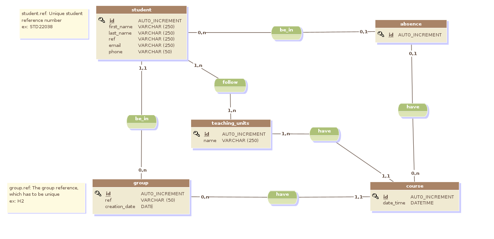

# HEI-AbsenceManagement
This project is used to manage student absences at HEI (Haute Ecole d'Informatique).


## Run Locally

- **Clone the project**

```
  git clone https://github.com/Sun-2302/HEI-AbsenceManagement.git
```

- **Install dependencies:** <br>
You can install the dependencies by running the following code or by using your IDE interface.

```
  cd HEI-AbsenceManagement
  mvn clean install
```

- **Create the database** by running the files [create_db.sql](java-absence-management/src/main/resources/migrations/create_db.sql) in your Postgresql Command Line 
```
 \i <absolute file path>
```

- **Add the mock data** by running the files [mock_data.sql](java-absence-management/src/main/resources/migrations/mock_data.sql) also in your Postgresql Command Line
```bash
 \i <absolute file path>
```

- Configure the files [PostgresqlConf](java-absence-management/src/main/java/school/hei/javaabsencemanagement/repository/PostgresqlConf.java
) by changing <your_username> and <your_password> by yours

```
  public final static String URL = "jdbc:postgresql://localhost:5432/absence_hei";
    public final static String USERNAME = "your_username";
    public final static String PASSWORD = "your_password";
```

- Connect the project and the database by using your IDE
- **Run the project**: <br>
To run the project, you just need to run the main methods in the [JavaAbsenceManagementApplication.java](java-absence-management/src/main/java/school/hei/javaabsencemanagement/JavaAbsenceManagementApplication.java
) files.


## Test

Now you can test the project by using an API testing tools like Postman or Insomnia. <br>
You can view the API specification in the files [openapi.yaml](java-absence-management/src/main/resources/openapi.yaml)

## Conceptual Data Model for the database

